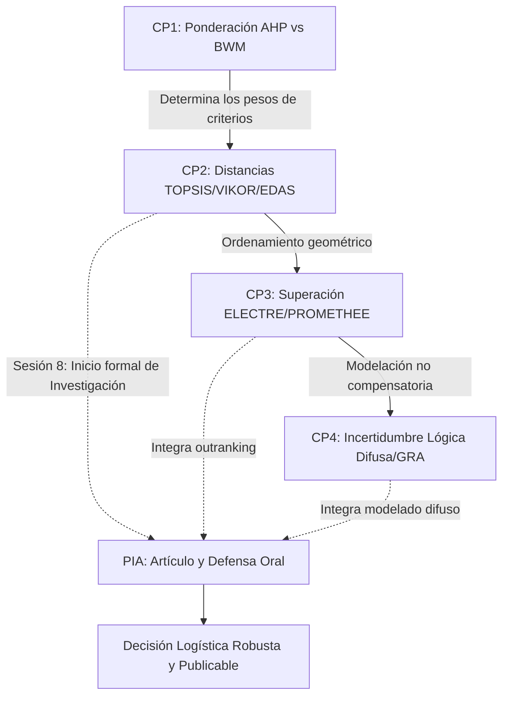

# 🔧 Flujo Metodológico de Casos Prácticos y PIA

El sistema de evaluación del curso se estructura en **4 Casos Prácticos (CP1-CP4)** metodológicos y un **Producto Integrador de Aprendizaje (PIA)** de investigación aplicada. El objetivo es que apliques de forma práctica los algoritmos matemáticos estudiados a lo largo del curso a un mismo problema logístico real, y a partir de la Sesión 8, los integres en un manuscrito científico final (artículo de investigación).

## Distribución de la Evaluación

1.  **[[CP1_Ponderacion|Caso Práctico 1]] (Peso: 15% / Entrega: Sesión 5)**
    - *Tema:* Determinación de la importancia (pesos) de criterios cuantitativos y cualitativos aplicando AHP y BWM.
2.  **[[CP2_Metodos_Distancia|Caso Práctico 2]] (Peso: 20% / Entrega: Sesión 8)**
    - *Tema:* Jerarquización de alternativas discretas aplicando TOPSIS, VIKOR y EDAS. (En esta sesión se inicia formalmente el PIA).
3.  **[[CP3_Superacion|Caso Práctico 3]] (Peso: 20% / Entrega: Sesión 10)**
    - *Tema:* Modelado no compensatorio e introducción de vetos usando ELECTRE I y PROMETHEE II.
4.  **[[CP4_Incertidumbre|Caso Práctico 4]] (Peso: 15% / Entrega: Sesión 13)**
    - *Tema:* Toma de decisiones bajo vaguedad utilizando conjuntos difusos (Fuzzy TOPSIS) o teoría de sistemas grises (GRA).
5.  **[[PIA_Proyecto_Final|Producto Integrador de Aprendizaje (PIA)]] (Peso: 30% / Entrega: Sesión 15)**
    - *Tema:* Formulación de un artículo de investigación científica en formato de revista indexada y su defensa oral, integrando los métodos previos y su análisis de robustez/sensibilidad.
